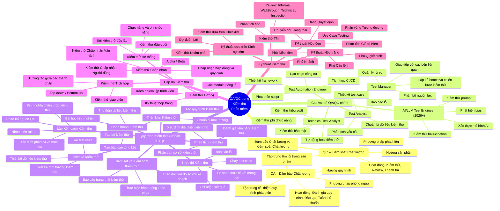

# Mindmap Vai Trò QA/QC theo ISTQB

## Sơ đồ Mermaid

---

## 3 Lỗi Tìm được trong Mindmap do AI Tạo (Sinh viên Review)

### Lỗi 1: Thiếu "Giám sát và Kiểm soát Kiểm thử" như hoạt động riêng biệt
**Lỗi AI:** Ban đầu AI gộp "Giám sát và Kiểm soát Kiểm thử" vào "Lập Kế hoạch" như hoạt động con.  
**Sửa lỗi:** Theo ISTQB CTFL v4.0, Mục 1.4, "Giám sát và Kiểm soát Kiểm thử" là một **hoạt động kiểm thử cơ bản riêng biệt**, không phải hoạt động con của Lập Kế hoạch. Nó chạy liên tục trong suốt quy trình kiểm thử.  
**Tham chiếu ISTQB:** ISTQB CTFL v4.0, Mục 1.4.3 – "Test monitoring and control is an ongoing activity."

### Lỗi 2: Phân loại sai các loại Kiểm thử Chấp nhận
**Lỗi AI:** AI liệt kê "Alpha / Beta testing" là loại riêng biệt cạnh UAT, nhưng thiếu **Kiểm thử Chấp nhận Vận hành (OAT)** – một phân loại quan trọng.  
**Sửa lỗi:** Theo ISTQB CTFL v4.0, Mục 2.2.4, Kiểm thử Chấp nhận bao gồm: (1) UAT, (2) OAT (backup/restore, khắc phục thảm họa, quản lý người dùng, bảo trì), (3) Chấp nhận Hợp đồng và Quy định, (4) Alpha/Beta. OAT đã bị bỏ sót.  
**Tham chiếu ISTQB:** ISTQB CTFL v4.0, Mục 2.2.4

### Lỗi 3: Thiếu hoàn toàn "Kiểm thử Tĩnh" (Static Testing)
**Lỗi AI:** Mindmap chỉ có kỹ thuật kiểm thử động (hộp đen, hộp trắng, dựa trên kinh nghiệm) mà hoàn toàn bỏ sót **Kiểm thử Tĩnh** bao gồm Review (Informal Review, Walkthrough, Technical Review, Inspection) và Phân tích Tĩnh.  
**Sửa lỗi:** Theo ISTQB CTFL v4.0, Chương 3, Kiểm thử Tĩnh là phần cơ bản của kiểm thử, bổ sung cho kiểm thử động. Mindmap cần có nhánh "Kiểm thử Tĩnh" với Review và Phân tích Tĩnh.  
**Tham chiếu ISTQB:** ISTQB CTFL v4.0, Chương 3 – "Static Testing"
